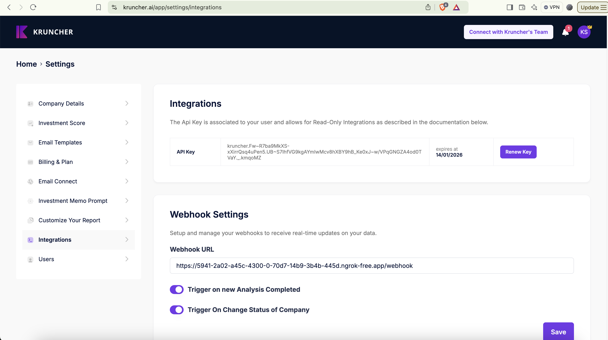

### Kruncher Integrations
Setup integration with Kruncher. Please find the example in express-integration for a running example.

Full API documentation
[API Documentation](/api-documentation.md)

### Setup ENVIRONMENT VARIABLES

1. Get your API key from: [Kruncher API Settings](https://kruncher.ai/app/settings/integrations)

2. Add in your webhook where you would like to receive your post requests. 
3. Select Trigger on New Analysis Receive. 
4. API_BASE_URL = https://api.kruncher.ai/api/integration'

Example .env
```js
PORT=8000
INTEGRATION_API_BASE_URL=https://api.kruncher.ai/api/integration
INTEGRATION_API_KEY=kruncher.Fw~Z7ba9MkXS-xXirrQsq5uPen5.UB~S7IhfV$9kgAYsIwMcv8hXBC9hB_Ke0xJ~w/VPqGNGZA4od4TVaY._.kmqoMZ
```
###### Please note that the API key is not active anymore and it just for example purpose. 


### Create new API response. 
1. Setup your API integation function
```js
const integrationApi = axios.create({
  baseURL: process.env.INTEGRATION_API_BASE_URL,
  headers: {
    Authorization: `${process.env.INTEGRATION_API_KEY}`,
    "Content-Type": "application/json",
  },
});
```

2. Create a new project 
```js
//check if the website is valid if not return it

function createProject(website:string, name?:string){
  if (!website || validURL(website) == false) {
    return res.status(400).json({ error: "Invalid website URL." });
  }
  const project = {
    name: name ? name : website, // required field
    companyWebsite: website, // required field
    projectType: "projectAnalysisNoFile", // add this filed for projectAnalysis baseed on website. 
  };

  try {
    const response = await integrationApi.post("/project", project);
  }catch(e){
    console.log('Something went wrong')
  }
}
```

3. New project is created with the response of
```json
{
    "metadata": {
        "code": "1000",
        "title": "Successful",
        "description": ""
    },
    "data": {
        "projectId": "76d4d78c-4451-4d43-a46d-5cefcccd59de",
        "analysisId": "5dab4014-df66-40a8-b5a6-6d3f4c14706f",
        "project": {
            "initial": "H",
            "colorLogo": "pink",
            "id": "76d4d78c-4451-4d43-a46d-5cefcccd59de",
            "name": "https://kruncher.ai",
            "companyName": null,
            "companyLegalName": null,
            "companyEmail": null,
            "companyWebsite": "https://kruncher.ai",
            "companyIndustry": null,
            "companyCountry": null,
            "companyBusinessModel": null,
            "companyStage": null,
            "companyRevenueRange": null,
            "companyLogo": null,
            "companySummary": null,
            "companyKeywordSummary": null,
            "isVisibile": false,
            "isPending": false,
            "isUnread": true,
            "processing": "In Progress",
            "originType": "manualUpload",
            "originFullName": "Manual (Koen Schuite)",
            "createdAt": "2025-01-14T15:39:46.389Z",
            "updatedAt": "2025-01-14T15:39:46.389Z",
            "customerId": "0f15a3e6-8bac-4eb9-876b-1d587b9a3365",
            "projectstatusId": "6cc34f51-d1fb-486d-82f8-2f0c1cda8e02",
            "projectphaseId": "631a9cd2-b24b-41cb-89c5-6f8330f7140a",
            "projectownerId": "a19062b4-b1a5-4520-986a-3b58373e3e58"
        }
    },
    "pagination": null
}
```
4. Please wait for a 5-15 minutes before the analysis is completed and returned to your webhook.
5. Once completed your will receive an event with the following data:
   ```json
   {
    "event":"analysisCompleted",
    "data":
        {
            "projectId":"de7a12ba-95a3-4049-ac23-20ce7585df65",
            "analysisId":"873071df-d738-42b1-9ef1-5f78de1442e7",
            "kruncherEntityCompanyId":"d650e9a7-7449-493a-951a-1d55da5ab874",
            "mappings":[],
            "projectName":"Kruncher"
        }
    }
   ``` 
6. You can now call the api to retrieve the infromation from this analyisis 
```js
app.post("/webhook", async (req, res) => {
  const event = req.body.event;
  const data = req.body.data;

  if (event === "analysisCompleted") {
    const { analysisId, projectId } = data;

    try {
      const analysisResponse = await integrationApi.get(`/analysis/detail?analysisId=${analysisId}`);
      const analysisDetails = analysisResponse.data;
      console.log(analysisDetails)
    }catch(e){
        console.log(e);
    }
  }
});
```

7. Response example: can be found [Analysis Example Response](/examples/analysis-response.json)


Happy integration! If there are any questions please don't hesitated to contact us at: francesco@kruncher.ai
